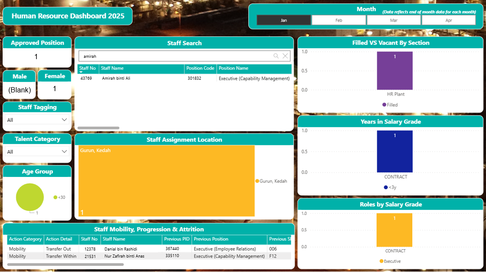

# 👥 Human Resource Dashboard

## 📌 Overview
This Power BI dashboard was developed to help the **HR department track and manage staff information** more efficiently. Previously, staff data was stored in **monthly Excel files**, making it difficult to monitor updates and take timely action.

The dashboard consolidates key HR data — such as **position details, gender breakdown, assignment location, salary grade, and mobility records** — into one **centralized interface**. It enables faster, more consistent tracking of staffing movement and helps HR professionals verify staff changes (e.g., transfers, upgrades, attrition) with confidence.

---

## 🔐 Confidentiality Note  
*All data shown has been anonymized or recreated to maintain company data confidentiality. Visuals are intended to demonstrate layout and dashboard features only.*

---

## 🎯 Problem Statement  
- HR staff had to **manually review different Excel files each month** to track staff info  
- Staff mobility and changes (e.g., transfers, promotions) were difficult to verify at a glance  
- No centralized view of staff status, assignment, or demographic breakdown  

---

## ✅ Solution  
This dashboard provides a **unified view of HR staff information**, allowing users to:  
- 🔍 **Search staff** by name or staff number  
- 📊 Monitor **filled vs vacant positions**, **roles by salary grade**, and **assignment locations**  
- 🔁 Track **staff mobility, progression, and attrition**  
- 📅 View **month-by-month changes** using a dynamic time slicer  

---

## 🛠 Tools & Technologies

| Tool           | Purpose                                  |
|----------------|------------------------------------------|
| **Power BI**   | Dashboard creation & interactivity       |
| **Excel**      | Monthly data source for staff records    |
| **Power Query**| Data cleanup and transformation          |
| **DAX**        | Metrics logic (vacancy count, role duration, etc.) |

---

## 🧭 Project Walkthrough

### 🖥️ Step 1: Dashboard Preview  
Main interface showing staff count, search filters, position details, role breakdown, assignment location, and mobility records.

  

*One-page view of all staff-related insights for HR tracking.*

---

### 🔎 Step 2: Staff Search Scenario  
User can search by **staff number or name**, and the entire dashboard will dynamically update to show filtered information (assignment, salary grade, etc.).

  

*All visuals reflect data based on selected staff name or number.*

---

## 🔍 Key Features

- 👤 **Staff-level filtering** by name or staff number  
- 📌 **Assignment location heatmap** to view staff distribution  
- 📈 **Filled vs vacant roles** by section  
- ⏱️ **Years in salary grade** & **role type** per grade  
- 🔄 **Staff mobility tracker** (transfer, promotion, attrition)  
- 📅 Month selector for historical data tracking  

---

## 📈 Impact

- Saved HR time by eliminating manual file checks  
- Made **staff movement easier to monitor**  
- Improved accuracy in tracking **staff reductions or changes**  
- Created a single source of truth for monthly HR data review  

---

## 🙋‍♀️ About Me  
I'm a Computer Science graduate with a focus on **data visualization and automation**. I enjoy building dashboards that make data more useful and decision-making more efficient.

[🔗 LinkedIn](https://www.linkedin.com/in/ainamardhiah2107/)
